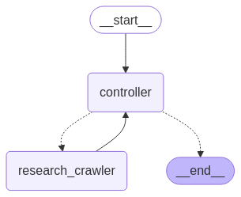

# DeepResearch with Langgraph

DeepResearch with Langgraph is a proof-of-concept project that implements OpenAI's DeepResearch functionality using Langgraph and Langchain. This tool allows you to input a seed query and perform in-depth, detailed research on any given topic by aggregating both direct and auxiliary information.

## Features

- **Seed Query Input:** Start your research with a simple seed query.
- **Deep Detailed Research:** Compiles extensive research data including auxiliary information.
- **Integrated Tools:**
  - **Langsmith:** For tracking and monitoring the research process.
  - **OpenAI LLM:** To power the deep research with advanced language processing.
  - **Zyte.com:** For web crawling to fetch relevant information.

## Graph Execution Diagram



## Prerequisites

- **Python 3:** Ensure Python 3 is installed on your machine.
- **Virtual Environment Management:** It is recommended to use a Python virtual environment.
- **UV Tool (Recommended):** For managing the virtual environment, use `uv`.

## Installation

1. **Clone the Repository:**

   ```bash
   git clone https://github.com/asaniczka/DeepResearch-with-Langgraph.git
   cd DeepResearch
   ```

2. **Environment Setup:**

   - Copy the example environment file and configure your variables:

     ```bash
     cp .env.example .env
     ```

   - Edit the `.env` file to set your environment variables.

3. **Set Up Virtual Environment (Using UV):**

   ```bash
   uv venv
   uv sync
   ```

## Usage

To execute the research script, run the following command with your topic:

```bash
python3 src/graphs/research_graph.py "topic to research"
```

## Tracking and Web Crawling

- **Langsmith:** Utilized for tracking and logging the research process.
- **OpenAI LLM:** Provides the underlying language model for deep research.
- **Zyte.com:** Powers the web crawling functionality to gather data from the web.

## Contributing

Contributions, bug reports, and feature requests are welcome! Please open an issue or submit a pull request to contribute.

## License

This project is licensed under the [Apache License](LICENSE).
